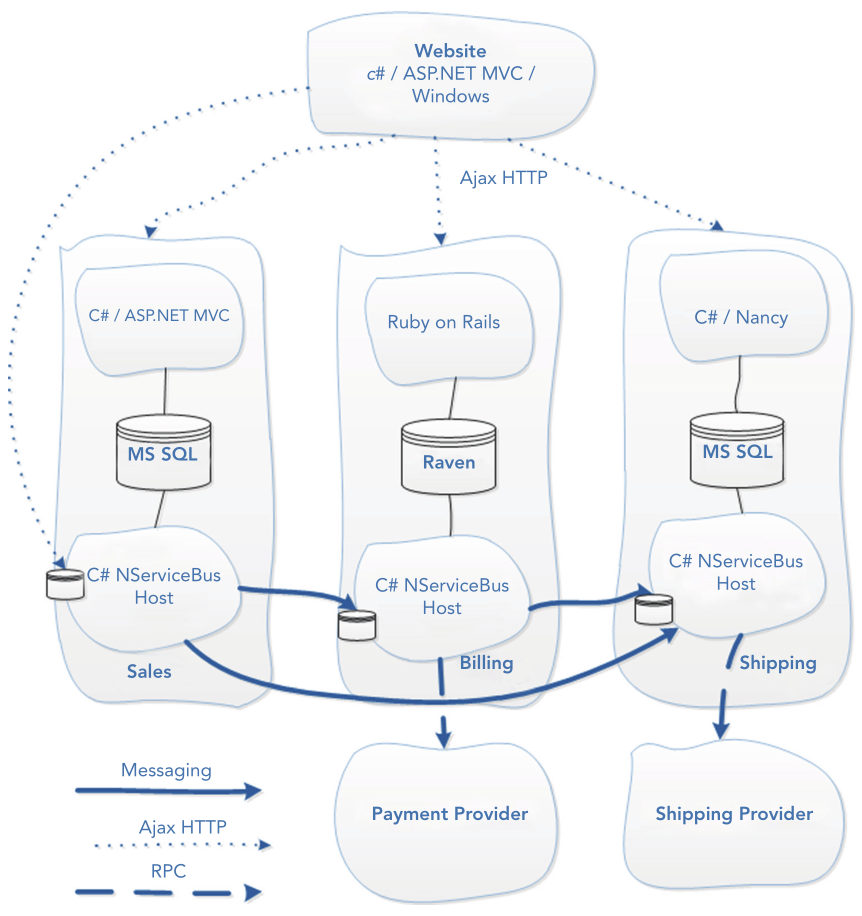
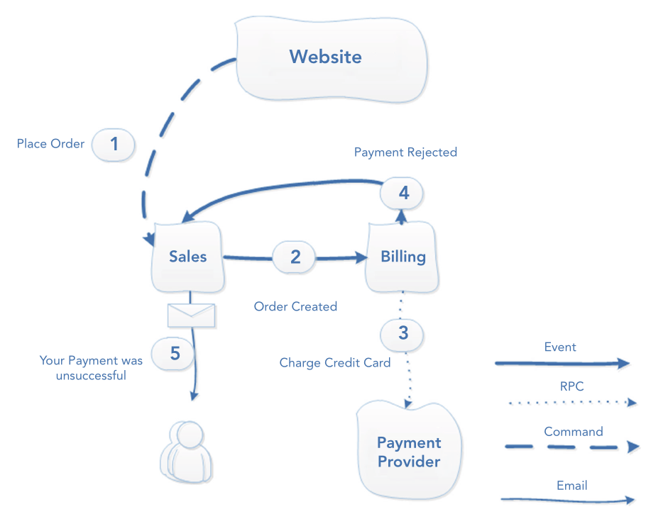
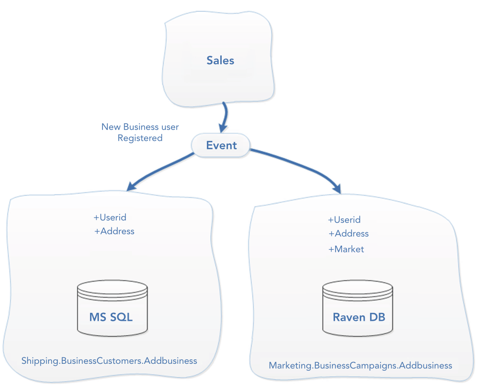
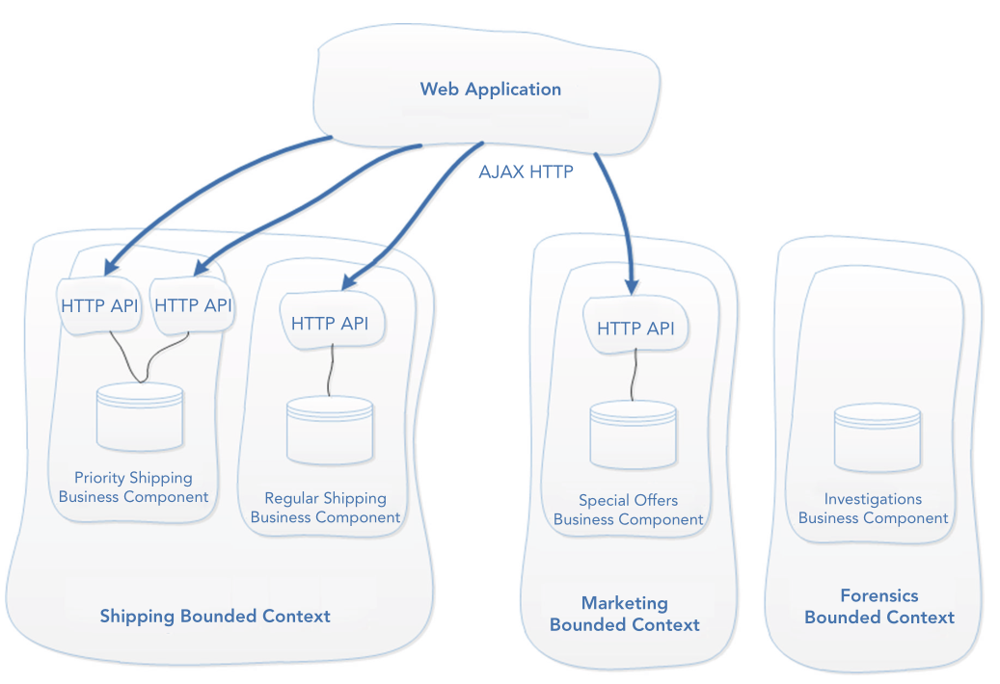

# Chapter 12. Integrating via Messaging 

## Overview 

- Integrating bounded contexts with asynchronous messaging using NServiceBus and Mass Transit
- Designing and modeling messaging systems around important events in the domain
- Understanding how messaging frameworks work
- Creating architectural diagrams
- Explanation of the conceptual differences between commands and events
- Theory and examples of industry‐standard messaging patterns
- Dealing with eventual consistency
- Monitoring errors in messaging systems
- Monitoring service level agreements (SLAs) in messaging systems

## Messaging Fundamentals
### Message Bus 
- **WHY**: A centralized component transmitting messages would suffer from single point of failure and hurt scaling (any more convincing reasons??)
- **DEFINITION**: a distributed system that has agents running on every component that sends or receives messages—avoiding the need for a centralized single point of failure
- **Benefit**: Decompling bounded contests by connecting each of them to the bus only

> **NOTE** A centralized component that receives and publishes all messages is known as a broker or message broker

### Reliable Messaging 
- **WHY**: Sending messages from one of your bounded contexts to another could be costly if there were no guarantees the message would ever get there, which will degrade user experience
- It's almost impossible to guarantee that a message will always be delivered only once
- Patterns
  - at‐least‐once
  - at‐most‐once
  - only‐once delivery
- At‐least‐once delivery involves retrying messages that failed or no acknowledgement from the receiver was received (appearing to fail). 
  - Based on a pattern known as **store‐and‐forward**

> **NOTE** *Idempotent messages* are messages that can be sent multiple times and only processed once

### Store‐and‐Forward 
- **HOW**
  - Store the message before it is sent
  - If the message reaches the recipient and is acknowledged, the local copy is deleted
  - Otherwise, it is tried again

### Commands and Events
- **COMMANDS**: messages specifying something needs to happen, and will be handled by only one receiver
- **EVENTS**
  - **DEFINITION**: messages signaling something **happened**, without care of receivers/subscribers
  - Advantage: Ability to add new subscribers without changing existing code
- Convention
  - Name commands as instructions that you want to happen
  - Name events in the past tense describing what has happened

### Eventual Consistency 
- **WHY**: In systems where each bounded contexts has its own database, messaging 
  - break big transactions into smaller ones 
  - achieve an **eventually consistent** state with all these smaller txs combined
- One of the most important aspects of eventually consistent systems is managing the **user experience**
- In eventually consistent systems, 
  - users often get an immediate confirmation that the request has been received
  - with further confirmations of following steps later
  
  which can appear to be a degradation of user experience

## Building an E‐Commerce Application with NATS

- Official Mirror of NATS is https://nats.io/

### Designing the System 
- 3 steps 
  0. The most important step is to start with the domain
  1. Create a containers diagram showing 
    - Application groupings
    - Technology choices
    - Communication protocols
  2. Create a component diagram showing the flow of logic between bounded contexts

#### Domain‐Driven Design
- **Event Storming**: Start by identifying important events that occur in the domain

##### Domain Events 
- **DEFINITION**: Important events that occur in the real‐world domain

##### Component Diagrams
- Communication between domain events and processes can be depicted by basic sketches together using just boxes and lines
- Component diagrams communicate the flow of logic or interaction between certain components 
- A component diagram showing domain events goes as 
  
  

#### Containers Diagrams 
- Before building the system, we need to map the requirements of the business onto a working, distributed software system that provides them value
- Containers diagrams show
  - How different parts of the system are grouped
  - How different parts of the system communicate
  - What the major technology choices are

  > **NOTE** Major technology choices are ones that have a big impact on the development, delivery, or maintenance of a project. They are usually those that are harder to change. Generally, major technology choices are operating systems, programming languages/run times, web servers, middleware, and major application frameworks such as web frameworks or concurrency frameworks
- A containers diagram of the e-commerce app goes as 
  

  - Some key notes 
    - Internal communication between bounded contexts uses messaging
    - Unreliable communication with the external payment provider is wrapped with a messaging gateway to add reliability
    - Each bounded context is able to use different technologies, including choice of database technology
    - Bounded contexts do not share databases or other dependencies
    - The website retrieves information from bounded contexts using the HTTP application programming interfaces (APIs) they provide via AJAX requests from the browser

  > **WARNING** Try to keep diagrams concise and effective by maintaining all details at the same level of abstraction

#### Evolutionary Architecture 

- If new events are added to the domain or your context boundaries need to be adjusted, you should try to model your architecture around your new findings and update your diagrams accordingly

### Sending Commands from a Web Application 
#### Creating a Web Application to Send Messages 
- **A good convention**
  - Each bounded context to have a project that contains just the messages it publishes
  - Other bounded contexts can reference this project to access the messages

  > **WARNING** Be careful that bounded contexts only share projects containing messages, to avoid the introduction of coupling by sharing more code.

#### Sending Commands 
- When sending commands, make sure you specify the recipient because commands are only handled in a single place
- Specifying the recipients is not necessary when publishing events. This is a useful distinction to remember.

### Handling Commands and Publishing Events 

- A naming convention: `{BoundedContext}.{BusinessComponent}.{Component}`
- A useful convention for handling messages is to create a class called `{MessageName}Handler`

#### Creating an Subscriber to Handle Commands 
#### Configuring the Solution for Testing and Debugging 

1. Start the `gnatsd` server
```bash
$GOPATH/bin/gnatsd
```

2. Bootstrap the web server

```bash
cd web && go run main.go
```

#### Publishing Events 
#### Subscribing to Events 
### Making External HTTP Calls Reliable with Messaging Gateways 

- Messaging gateways wrap unreliable communication with a message so that it can be retried until the stricken service is available again

#### Messaging Gateways Improve Fault Tolerance 

- Essentially, messaging gateways split one big transaction in half, so if one of the calls fails, you don't repeat actions that have already been carried out (like charging a customer's credit card)

#### Implementing a Messaging Gateway 

##### Start by Defining the Messages
As Listing 12-10

##### Then Implement Each Handler

#### Controlling Message Retries 

- Retrying mechanism isn't built-in in `go-nats`

### Eventual Consistency in Practice 
#### Dealing with Inconsistency 
- When you are in an inconsistent state, you need to roll forward into a new state that represents the wishes of the business or the real‐world domain processes you are modeling

#### Rolling Forward into New States 

- Use case: when a payment is rejected, it is the Sales team's responsibility to inform the customer the order was cancelled, whose partial component diagram goes as 
  
  

### Bounded Contexts Store All the Data They Need Locally 
- **Problems**: How can you arrange shipping when all you have is the ID of an order
  - option 1: RPC to `sales.customers` would introduce a temporal coupling
  - option 2: publishing the customer's address on the `PaymentAccepted` event would cause high coupling and hard‐to‐debug issues trying to work out where data came from

#### Storage Is Cheap—Keep a Local Copy 

- Use case: the user registration process, depicted as 
    

#### Common Data Duplication Concerns 
##### The Data Is Conceptually Different
##### Avoid Inconsistencies by Using Validity Periods
- **WHY**: Shared data is changed in one bounded context, but not synchronized simulatanously on other bounded context. 
- **Example** goes as one price is shown online but charged differently when paid

##### The Economics of Duplicating Data
- Storage is so cheap, teams are normally happy to accept the costs of duplicating data so they can focus on delivering business value faster

##### Messages Arriving Out of Order
- General idea: simply put the message back on the queue and retry it again later

### Pulling It All Together in the UI 
#### Business Components Need Their Own APIs 
- The suggested layout goes as 
  

#### Be Wary of Server‐Side Orchestration 
- Server-side orchestration can undo a lot of the hard work of building a loosely coupled, fault‐tolerant system, because you have introduced another coupling point

#### UI Composition with AJAX Data 
- This style of UI composition can work especially well when you are trying to build fast, singe-page applications (SPAs) or generic APIs that are used by many other websites

#### UI Composition with AJAX HTML 
- It can be hard to manage the consistency of the page that would normally be easy to achieve when the HTML lived in a single file
- This approach is also difficult to apply when multiple web applications share the API

#### Sharing Your APIs with the Outside World 
## Maintaining a Messaging Application 

- **WHY**: Find any errors that are occurring so you can fix them and prevent lost revenue
- **HOW**: Employ a strategy for dealing with development changes that affect multiple teams, such as change in the structure of a domain event

### Message Versioning 

- **WHY**
  - The message format is the contract between two teams
  - Any changes to the format may require input and collaboration from both teams

#### Backward‐Compatible Message Versioning 

- Concerning factors
  - new fields
  - deprecated fields

#### Handling Versioning with Polymorphic Handlers 

- The method described is applicable to languages supporting inheritance, and goes as 
  1. Create a new version of the message that inherits the original version
  2. Update handlers that require the new version to handle the new version
  3. Add subscription details for the new message in each subscriber's App.config 
  4. Update the sender to send the new version of the message.
- For message encoded in JSON, we can simply add the new field to the structure

### Monitoring and Scaling 
- **WHY**: Monitoring errors to ensure that users are getting an acceptable level of service

#### Monitoring Errors 

- Transient error: errors resolved after some time 
- Poison messages: failing messages triggering the unsolvable errors no matter how many retrials
- In case of persistent errors, manual intervention is required to determine what happens to it next

#### Monitoring SLAs 

- About measuring the rate and frequency of messages flowing through your system

#### Scaling Out 

- **WHEN**
  - Messages are spending a long time in the queue
  - The businesses are telling you that customers are complaining about slow turnaround times
- **WHAT**: scale the system to process messages faster

## Integrating a Bounded Context with another Messaging Framework 

- **WHEN**: The new bounded isn't using the same messaging as the running ones
- Pattern: **the messaging bridge**

### Messaging Bridge 
- **WHEN**: Two separate messaging systems that need to share messages
- **HOW**: Create an application that can receive messages from one messaging system and hand them over to the other

### [message-bus](https://github.com/vardius/message-bus)
#### Installing 
```bash
go get -u -v github.com/vardius/message-bus
```
#### Declaring Messages for Use
#### Creating a Message Handler 
#### Subscribing to Events 
#### Linking the Systems with a Messaging Bridge 
#### Publishing Events 
#### Testing It Out 
#### Where to Learn More about Mass Transit 