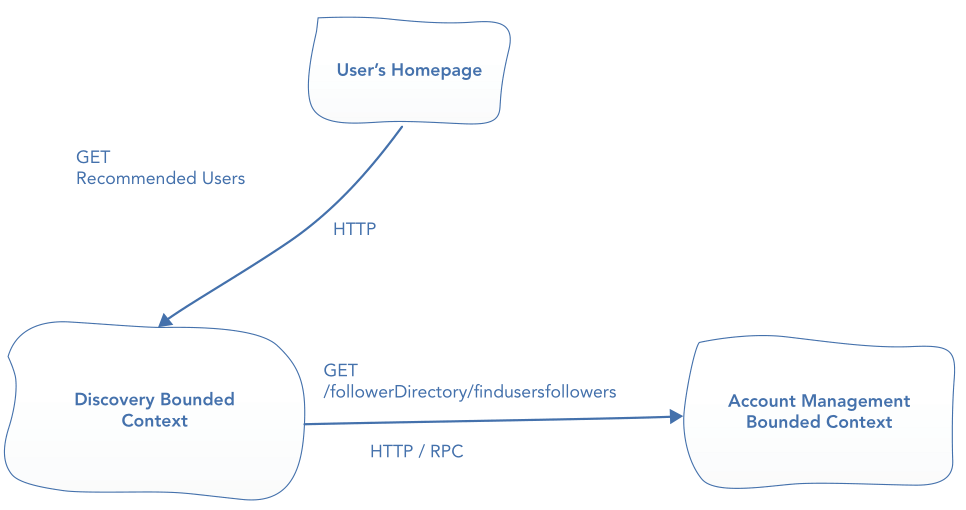

# Chapter 13. Integrating via HTTP with RPC and REST

## Why Prefer HTTP?
### No Platform Coupling
- A platform‐agnostic protocol helps to create
  - loosely coupled applications
  - loosely coupled teams that have few dependencies on each other
### Everyone Understands HTTP
- Almost all programming languages and run times have a wealth of libraries and support for using HTTP
- Helpful to expand team
### Lots of Mature Tooling and Libraries
- Examples: Visual Studio  
### Dogfooding Your APIs

- **DEFINITION**: The practice of using the APIs internally that you share with clients and partners
- Build APIs that 
  - bounded contexts use to communicate internally
  - exported to third parties
- If your API contains pain points that are putting customers off, dogfooding might help you find and remove them

## RPC
- Features
  - useful when development speed is important or scalability needs are not too high
  -  the inherent tight coupling associated with RPC can make scalability requirements and loosely coupled teams harder to achieve
### Implementing RPC over HTTP
- Traditional: **SOAP** (Simple Object Access Protocol)
- Modern: use XML (eXtensible Markup Language) or JSON (JavaScript Object Notation) as the payload in an RPC call
- Demo as a social media application consists of two bounded contexts
  - Problem: a BBoM where bounded contexts are merely libraries that have a binary dependency on each other
  - Goal: isolating each bounded context as a standalone application that can only be communicated with over HTTP
  - **HOW**: use RPC to replace in‐process method calls from one bounded context to another with RPCs over the network
  - Use cases
    - find recommended users
      
      > **Discovery Bounded Context**: The domain area drived by an entire team of business people and developers is focused on helping users discover content
#### SOAP
- **One big pain point** is the complexity and verbosity of its message format
#### Plain XML or JSON: The Modern Approach to RPC
##### Implementing RPC over HTTP with JSON
### Choosing a Flavor of RPC
## REST
### Demystifying REST
#### Resources
#### Hypermedia
#### Statelessness
#### REST Fully Embraces HTTP
#### What REST Is Not
### REST for Bounded Context Integration
#### Designing for RES
#### Building Event‐Driven REST Systems with ASP.NET Web API
### Maintaining REST Applications
#### Versioning
#### Monitoring and Metrics
### Drawbacks with REST for Bounded Context Integration
#### Less Fault Tolerance Out of the Box
#### Eventual Consistency 