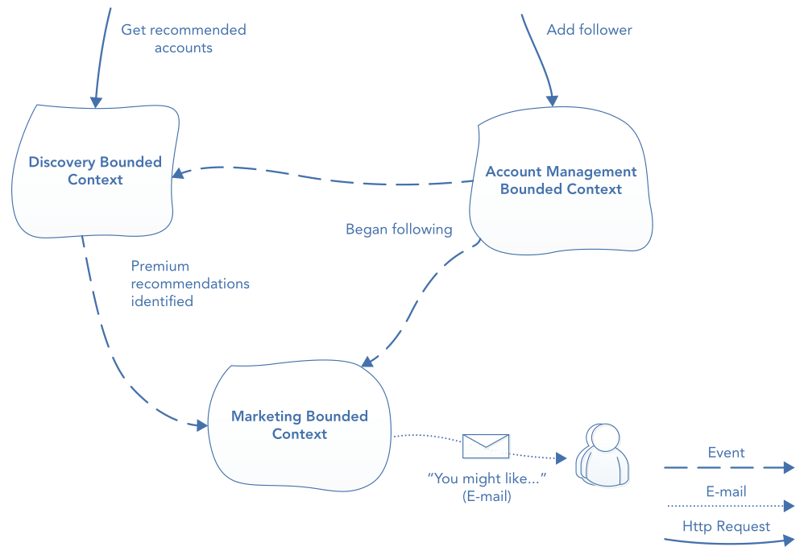
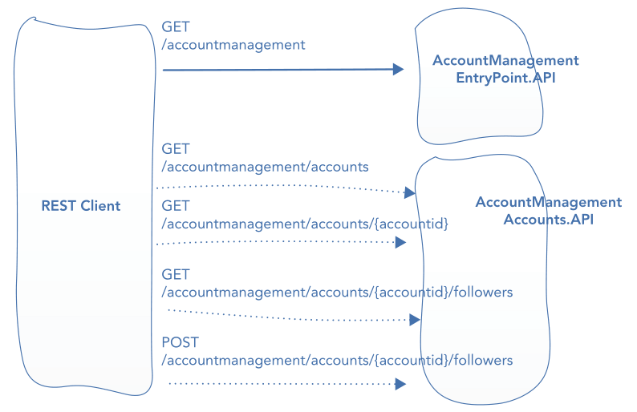
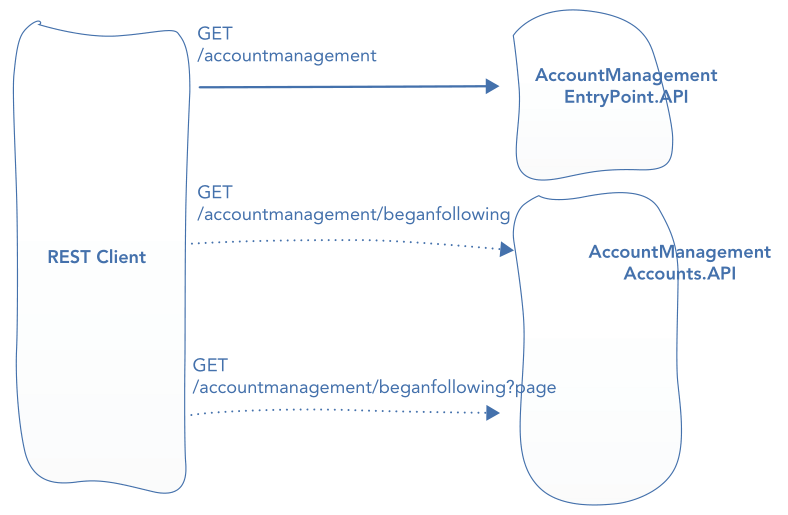

# Chapter 13. Integrating via HTTP with RPC and REST

## Why Prefer HTTP?
### No Platform Coupling
- A platform‐agnostic protocol helps to create
  - loosely coupled applications
  - loosely coupled teams that have few dependencies on each other
### Everyone Understands HTTP
- Almost all programming languages and run times have a wealth of libraries and support for using HTTP
- Helpful to expand team
### Lots of Mature Tooling and Libraries
- Examples: Visual Studio  
### Dogfooding Your APIs

- **DEFINITION**: The practice of using the APIs internally that you share with clients and partners
- Build APIs that 
  - bounded contexts use to communicate internally
  - exported to third parties
- If your API contains pain points that are putting customers off, dogfooding might help you find and remove them

## RPC
- Features
  - useful when development speed is important or scalability needs are not too high
  -  the inherent tight coupling associated with RPC can make scalability requirements and loosely coupled teams harder to achieve
### Implementing RPC over HTTP
- Traditional: **SOAP** (Simple Object Access Protocol)
- Modern: use XML (eXtensible Markup Language) or JSON (JavaScript Object Notation) as the payload in an RPC call
- Demo as a social media application consists of two bounded contexts
  - Problem: a BBoM where bounded contexts are merely libraries that have a binary dependency on each other
  - Goal: isolating each bounded context as a standalone application that can only be communicated with over HTTP
  - **HOW**: use RPC to replace in‐process method calls from one bounded context to another with RPCs over the network
  - Use cases
    - find recommended users
      
      > **Discovery Bounded Context**: The domain area drived by an entire team of business people and developers is focused on helping users discover content
#### SOAP
- **One big pain point** is the complexity and verbosity of its message format
#### Plain XML or JSON: The Modern Approach to RPC
##### Implementing RPC over HTTP with JSON
- Two implementations go as Listing 13-6 and 13-7
### Choosing a Flavor of RPC
- Inherent flaws to RPC
  - harder to scale efficiency
  - If the chain or RPCs spanned three bounded contexts, then three bounded contexts may need to be scaled due to the **temporal coupling**
## REST
### Demystifying REST
- Fundamental concepts 
  - resources 
  - hypermedia
#### Resources
- HTTP requests to a RESTful system are for resources. 
- Responses contain the requested resource (if successful)

> **WARNING**: There is a difference between URIs and URLs that's important to be aware of. You shouldn’t think of them as meaning exactly the same. Essentially, URLs are just one type of URI; there are other types, although they are less common. You can learn more about the differences on Wikipedia (http://en.wikipedia.org/wiki/Uniform_resource_identifier).

- Resources have a one‐to‐many relationship with representations
- Based on the same responsed resource, presentation can differ according to the syntactic rules of the requested format
- clients of RESTful APIs choose a format by specifying the required Multi Media Encoding (MIME) type in HTTP's "Accept" header
- Mapping between URIs and resources are many-to-one
- Resources can be hierachical

#### Hypermedia
- Using hypermedia in machine‐to‐machine communication helps to decouple clients of a RESTful API and its URIs, thus its servers, freeing both to evolve independently.

#### Statelessness
- **WHY**: to achieve fault tolerance and scalability thanks to no need of maintaining application states
#### REST Fully Embraces HTTP
##### Verbs 

| URI                         | VERB   | ACTION                  |
| --------------------------- | ------ | ----------------------- |
| `/accounts/user123`         | GET    | Read/fetch the resource |
| `/accounts/user123`         | DELETE | Delete the resource     |
| `/accounts/user123`         | PUT    | Create the resource     |
| `/accounts/user123/address` | POST   | Update the resource     |

- A single uniform set of verbs across the entire Internet eases the building of generic API clients and infrastructure components, such as caches, that understand the web's conventions

##### Status Codes 

| STATUS CODE GROUP | DEFINITION    | EXAMPLE                                              |
| ----------------- | ------------- | ---------------------------------------------------- |
| `1xx`             | Informational | Rarely used                                          |
| `2xx`             | Success       | The requested resource is returned                   |
| `3xx`             | Redirection   | The requested resource has been moved somewhere else |
| `4xx`             | Client error  | The supplied parameter value is invalid              |
| `5xx`             | Server error  | A API bug prevents the requested resource            |

- A common set of status codes enforces a uniform understanding of web conventions
> More on http://en.wikipedia.org/wiki/List_of_HTTP_status_codes 

##### Headers 
- For security, authentication and authorization details should be communicated in headers using protocols such as *OAuth*

#### What REST Is Not
- RESTful API must center on hypermedia and resources
- Some basic requirements goes as  http://roy.gbiv.com/untangled/2008/rest‐apis‐must‐be‐hypertext‐driven
- A countermeasure against abuse is [the Richardson Maturity Model](https://martinfowler.com/articles/richardsonMaturityModel.html)
### REST for Bounded Context Integration
- New use case: With some killer new features and viral marketing campaigns, user sign‐ups for the fictitious social media start‐up have again increased exponentially. The business wants to cash in on its success by adding premium accounts that are promoted to regular users
#### Designing for REST 
##### DDD
- Before a a technical decision, it nearly always makes sense to work out 
  - what problem you need to solve, and 
  - what domain processes you need to model
- The component diagram for the Recommended Accounts use case goes as 
  

##### SOA 
- Isolating bounded contexts each owned by a single team to achieve loose coupling
- All that changes when using SOA with HTTP compared to messaging is that **the contract between teams** is no longer classes in code, but **the format of HTTP requests and responses**

##### Event-Driven and Reactive 
- **HOW**: clients poll for changes 

> **NOTE** Technically, it is possible to build scalable, event‐driven systems with REST without resorting to polling. Each event publisher can keep a list of subscribers and a URL for each of them where a message can be published to. This approach tends to be more complex and often stirs up debates about statelessness

- The container diagram for the new Reactive, RESTful social media system goes as (**TO BE UPDATE**)
  
- One project per resource for fine-grained granularity control is recommended to achieve scalability

##### HTTP & Hypermedia
- A good way to design REST workflows is to use sequence diagrams
-  An example demonstrates the event‐driven Add Follower use case
    
- **HAL** (Hypertext Application Language) is essentially just well‐known existing content types—XML and JSON—with conventions for representing hypermedia links
- **Atom** (with content type as `application/atom+xml`) is a common standard for producing RSS feeds and thus is a great fit for representing lists of event
  - Using Atom as a feed of events is the main building block for building event‐driven distributed systems with REST in this chapter. An example goes as 
    

#### Building Event‐Driven REST Systems
- Follow an outside-in implementation style
  
##### Hypermedia‐Driven APIs
- The key benefit of hypermedia is that it decouples clients and servers, allowing independent evolution

###### Entry Point Resource
- Clients query a REST API by requesting the entry point resource
- Choices of the location of entry point(s)
  - a single entry point per‐bounded context
  - a single entry point for the entire system
  - an entry point per top‐level resource
- Designing an entry point involves identifying the **initial resources** and **transitions** (triggered by hyperlinks) that should be available to consumers of the API
- **Link relations** indicates what the link represents
  
###### HAL
- Two main flavors: XML and JSON 
- Conventions for representing link in HAL (JSON)
  - An example for demo
    ```json
    {
      "_links": {
        "self": {
          "href": "http://localhost:4100/accountmanagement"
        },
        "accounts": {
          "href": "http://localhost:4101/accounts"
        }
      }
    }
    ```
  - All links must be defined within an element at the root of the resource called `_links`
  - Each link begins with its relation (the **mandatory** `self` and `accounts` in the example)
  - Each link also contains an `href`, the URI pointing to the resource

###### URI Templates 
- A common concern people have for hypermedia: **inefficient navigation**
- To represent URI templates, not only do you need to set the `templated` attribute to `true`, but you must also add placeholder sections in the URI
- The `alternative` link relation represents links that have a different URI but point to the same resource (`self`)

> **WARNING** Model‐binding to domain classes or data structures used for persistence can lead to tight coupling. It is shown in Listing 13-19 for simplicity but is not recommended for important production applications.

###### Persisting Events with the Event Store
- Prerequisites
  - docker for run EventStrore daemon
  - PostMan for requesting and monitoring respones


### Maintaining REST Applications
#### Versioning
#### Monitoring and Metrics
### Drawbacks with REST for Bounded Context Integration
#### Less Fault Tolerance Out of the Box
#### Eventual Consistency 